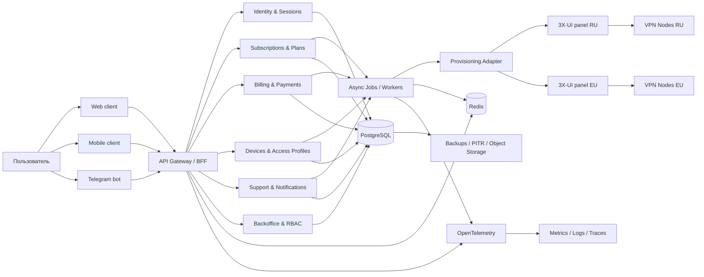
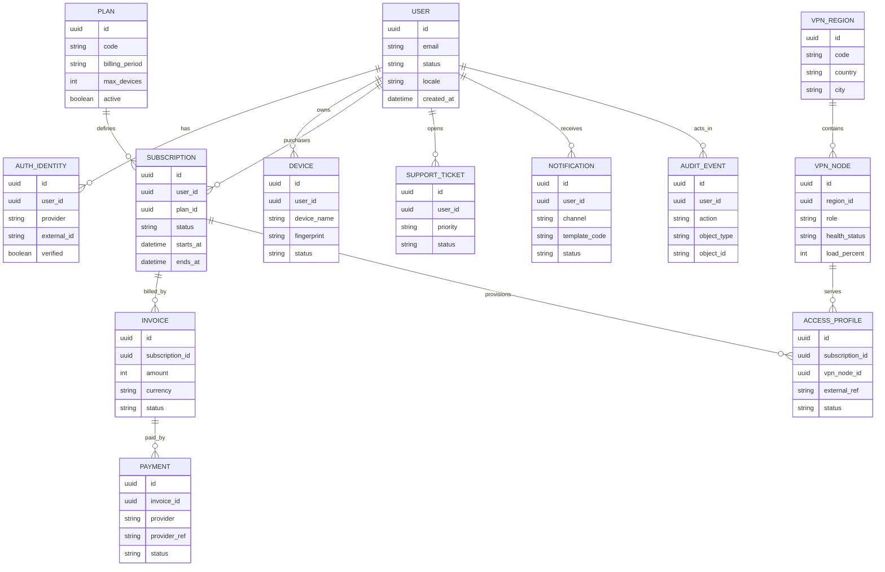
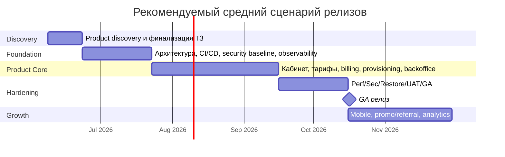

# Полноценное ТЗ для продуктовой версии INFINDA VPN

## Исполнительное резюме

Хотя в исходном брифе сказано, что текущее ТЗ не приложено, в этой сессии доступен черновик **Technical spec v1.0 for INFINDA VPN**. Он действительно выглядит как **MVP-ориентированное** ТЗ: в нем уже есть лендинг и кабинет, базовая регистрация и вход, покупка подписки, выдача VPN-конфигов, Telegram-бот, простая админка, интеграция с 3X-UI и ограниченное количество VPN-локаций; при этом часть функций явно отложена “после MVP”. Это позволяет использовать документ как фактический baseline для переработки в продуктовую спецификацию. fileciteturn0file0

Для перехода от MVP к полноценному продукту спецификация должна перестать быть только списком экранов и API-эндпоинтов и стать **управляющим документом для продукта, разработки, безопасности, эксплуатации и приемки**. В практическом смысле это означает: зафиксировать бизнес-цели, роли пользователей, приоритеты по модулям, целевые показатели качества, политику безопасности, требования к доступности и восстановлению, единый контракт API, требования к логированию и мониторингу, а также критерии готовности релиза. Такой подход согласуется с назначением OWASP ASVS как базы для проверки технических security-контролей и для спецификации требований в договорах и закупках; с ISO/IEC 25010:2023 как моделью качества продукта; с WCAG 2.2 как базой требований доступности; и с GDPR/PCI DSS для privacy/payment-контуров. citeturn3view0turn26view1turn4view6turn5view0turn6view0turn6view1

Рекомендуемая целевая архитектура для такого продукта — **модульный монолит control plane** с четкими доменными границами, отдельным адаптером к 3X-UI, единым источником истины в PostgreSQL, асинхронными воркерами для платежей/уведомлений/провижининга, наблюдаемостью через OpenTelemetry и контрактным API, описанным в OpenAPI. Для домена такого масштаба это рациональнее старта с микросервисов: индустриальная практика указывает, что microservices дают преимущества на крупных и зрелых границах, но увеличивают распределенную сложность и операционную цену; “monolith first” обычно дает быстрее продуктовый feedback cycle и более безопасный путь к последующему выделению сервисов. citeturn15view0turn15view1turn14view2turn6view2

Ни бюджет, ни сроки, ни целевой рынок, ни точная модель монетизации в брифе **не заданы**. Поэтому ниже дается **детализированное ТЗ-шаблон для полноценного продукта** с явными местами, где заказчик должен принять решения. В конце приведены три сценария оценки — **агрессивный, средний и консервативный** — и перечень открытых вопросов, без которых нельзя зафиксировать коммерчески и юридически окончательный вариант. fileciteturn0file0

## Исходные предпосылки и целевая модель

Доступный draft v1.0 подтверждает, что продукт сегодня мыслится как **consumer VPN subscription service** с веб-фронтендом, Django REST back-end, PostgreSQL/Redis/Celery, Telegram-ботом, Nginx и 3X-UI как operational-pannel для VPN-узлов. Из этого следует важный архитектурный вывод: для полноценного продукта нужно отделить **business truth** от **infrastructure truth**. Иначе подписки, устройства, платежи, устройства доступа, инциденты и поддержка будут жить частично в приложении, частично в 3X-UI/локальных БД VPN-нод, что плохо масштабируется и плохо аудируется. fileciteturn0file0

| Параметр | Текущее состояние | Для продуктовой версии |
|---|---|---|
| Исходное ТЗ | Есть draft v1.0, фактически MVP | Использовать как baseline и расширить до product spec |
| Платформы | Веб и Telegram описаны, мобильные требования не заданы | Считать целевыми web + mobile clients |
| Бюджет | Не задано | Сценарная оценка в конце отчета |
| Сроки | Не заданы | Сценарная оценка в конце отчета |
| Целевые рынки | Не заданы | Нужно утвердить: ЕС, СНГ, глобально, смешанная модель |
| Юридическая модель | Не задана | Нужна отдельная legal review по рынкам и платёжному контуру |
| Масштаб | Не задан | Проектировать минимум с путём роста от MVP до production-scale |

Полноценный продукт должен измеряться не только наличием функций, но и достижением бизнес-результата. Для VPN-подписочного сервиса разумно фиксировать следующие цели как **предлагаемые**, пока заказчик не утвердит финальные KPI.

| Бизнес-цель | Предлагаемый KPI | Предлагаемая целевая зона |
|---|---|---|
| Быстрое первое ценностное действие | Время от регистрации до первой успешной выдачи конфига | median ≤ 10 минут |
| Конверсия в оплату | Успешность платежного потока | ≥ 97% технически валидных попыток |
| Активация | Доля пользователей, выполнивших первую успешную выдачу доступа после оплаты | ≥ 95% |
| Удержание | Monthly paid churn | целевое значение задает заказчик; для старта закладывать контроль и аналитику churn |
| Экономика поддержки | Доля self-service обращений | ≥ 25% через FAQ/status/support flows |
| Надежность control plane | Availability личного кабинета и API | SLO не ниже 99.9% |
| Управляемость релизов | Deployment frequency / lead time / change failure rate / recovery time | отслеживать как обязательные engineering KPI citeturn24view0turn32view0turn32view1 |

Целевые пользователи и внутренние роли следует зафиксировать сразу, потому что без этого невозможно корректно спроектировать UX, RBAC и аналитику.

| Роль | Основная задача | Ключевые потребности |
|---|---|---|
| Гость | Сравнить, понять доверие к сервису, купить | Прозрачные тарифы, понятный onboarding, trust-сигналы |
| Подписчик | Купить, подключить устройства, продлить подписку | Простой кабинет, конфиги, история оплат, уведомления |
| Продвинутый пользователь | Управлять несколькими устройствами/локациями | Быстрый self-service, лимиты, переключение серверов |
| Саппорт | Решать тикеты без доступа к критичным секретам | Ограниченный RBAC, журнал действий, шаблоны ответов |
| Финансы/маркетинг | Видеть платежи, промо, кампании, конверсии | Отчеты, сегменты, экспорт, купоны |
| Администратор/оператор | Следить за узлами, емкостью, инцидентами | Inventory, health, нагрузки, аудит, алерты |
| Руководитель продукта | Управлять roadmap и качеством | Funnel-аналитика, retention, release metrics |

## Функциональные модули и UX/UI

Ниже — **целевой список модулей** для полноценного продукта. Приоритеты заданы как **P0 / P1 / P2**, где **P0** — без этого продукт нельзя считать production-ready, **P1** — критично для продуктовой эффективности после GA, **P2** — масштабирование и growth features. Расширение baseline оправдано тем, что текущий draft покрывает преимущественно core subscription flow, а OWASP API Security отдельно подчеркивает важность объектной авторизации, inventory/documentation API и ограничения бизнес-потоков и ресурсов, которые обычно всплывают именно после MVP. fileciteturn0file0 citeturn17view0turn17view1turn17view2

| Модуль | Содержание для продуктовой версии | Приоритет |
|---|---|---|
| Идентификация и доступ | email/password, Telegram-linked identity, управление сессиями, step-up для чувствительных действий, MFA для админов, risk-based re-auth | P0 |
| Личный кабинет | профиль, текущая подписка, устройства, конфиги, история операций, уведомления, действия self-service | P0 |
| Каталог и тарифы | планы, периоды, скидки, bundle-правила, региональные ограничения, A/B-ready pricing model | P0 |
| Биллинг и платежи | заказ, инвойс, платежные провайдеры, webhooks, возвраты/ошибки, статусы, идемпотентность | P0 |
| Провижининг подписки | выдача/обновление/отзыв доступа, синхронизация с 3X-UI, лимиты устройств, fair use hooks | P0 |
| Inventory VPN-узлов | регионы, ноды, состояния, нагрузка, capacity, правила подключения, технический статус | P0 |
| Notifications center | email, Telegram, in-app, события оплаты, окончания подписки, инциденты, маркетинговые opt-in | P0 |
| Backoffice и RBAC | роли superadmin / support / finance / ops / marketing / readonly, аудит действий | P0 |
| Security & compliance center | privacy settings, consent records where applicable, data export/delete workflow, retention policies | P0 |
| Support center | FAQ, тикеты, макросы, вложения, статусы, escalation paths | P1 |
| Status page и incident communication | публичный/полупубличный статус, история инцидентов, коммуникация во время outage | P1 |
| Promo / referral / coupons | промокоды, рефералы, партнерские кампании, анти-фрод правила | P1 |
| Product analytics | события funnel, retention, churn, cohorts, billing dashboard, release health | P1 |
| Мобильные клиенты | iOS/Android клиент или оболочка над standard VPN import flow, push notifications, mobile UX | P1 |
| Partner / reseller contour | партнерский кабинет, white-label-ready primitives, API access | P2 |
| Advanced anti-abuse | аномалии, carding/risk scoring, шаринг-доступа, behavioral heuristics | P2 |

Полноценный UX для такого продукта должен требовать не только “красивые экраны”, но и **доказуемо удобные и доступные сценарии**. WCAG 2.2 прямо добавляет требования по **Redundant Entry** и **Accessible Authentication**: ранее введенная пользователем информация не должна запрашиваться заново, если ее можно подставить автоматически, а аутентификация не должна строиться на обязательных когнитивных тестах без альтернативного механизма. Поэтому onboarding, оплата и восстановление доступа должны быть максимально короткими, но при этом не ломать доступность. citeturn4view7turn28view0turn28view1

| Сценарий | Ожидаемый happy path | Что система должна уметь |
|---|---|---|
| Первая покупка и активация | Выбор тарифа → заказ → PSP/crypto flow → подтверждение → выдача доступа | Идемпотентный заказ, проверка webhook, моментальная активация, понятный error recovery |
| Продление подписки | Напоминание → pay now → продление без прерывания доступа | Умные уведомления, retry logic, invoice history |
| Превышение лимита устройств | Пользователь видит список девайсов → удаляет старый → мгновенно активирует новый | Device registry, безопасный reset, аудит событий |
| Инцидент с локацией | Продукт предупреждает о деградации → предлагает альтернативную ноду | Server health, incident banner, fallback flow |
| Обращение в поддержку | Пользователь открывает тикет и видит SLA/статус | Context-aware support, привязка заказов и подписки к тикету |

Низкоуровневые wireframes для ключевых экранов следует зафиксировать уже в ТЗ, чтобы исключить двусмысленность трактовки.

```text
WEB: Личный кабинет

+----------------------------------------------------------------------------------+
| Logo | Кабинет | Серверы | Оплата | Поддержка | Профиль                          |
|----------------------------------------------------------------------------------|
| Текущий план: PRO 30 дней     Статус: Active     Продлить: [Кнопка]              |
| До окончания: 12 дней         Устройств: 2/5     Telegram: connected             |
|----------------------------------------------------------------------------------|
| Быстрые действия                                                             |
| [Скачать конфиг] [Открыть QR] [Добавить устройство] [Сменить локацию]           |
|----------------------------------------------------------------------------------|
| Доступные локации                                                              |
| RU Moscow | Load 64% | Ping 26 ms | Status OK | [Выбрать]                        |
| EE Tallinn| Load 38% | Ping 44 ms | Status OK | [Выбрать]                        |
|----------------------------------------------------------------------------------|
| Платежи                | Уведомления                | Поддержка                    |
| Последний инвойс       | Подписка истекает через..  | Тикет #548: In progress      |
+----------------------------------------------------------------------------------+
```

```text
MOBILE: Главный экран

+----------------------------------+
| INFINDA                          |
|----------------------------------|
| Plan: PRO Monthly                |
| Active until: 2026-11-14         |
| Devices: 2/5                     |
|----------------------------------|
| [ Получить доступ ]              |
| [ Сменить сервер ]               |
|----------------------------------|
| Current server: Tallinn          |
| Health: OK                       |
|----------------------------------|
| Payments | Notifications | Help  |
+----------------------------------+
```

## Нефункциональные требования и архитектура

Для продуктовой версии NFR должны стать частью приемки, а не “рекомендациями на потом”. ISO/IEC 25010:2023 описывает модель качества через девять характеристик продукта; OWASP ASVS задает базу для security verification; NIST SP 800-63B — современную политику аутентификации; GDPR Art. 25/32/33 — privacy by design, security of processing и реакцию на breach; PCI DSS задает baseline технических и операционных требований для защиты платежных данных. citeturn26view1turn3view0turn4view4turn4view5turn21view1turn20view5turn20view6turn20view7turn6view0turn6view1

| Группа требований | Требование для продуктовой версии | Основание |
|---|---|---|
| Производительность | API чтения: p95 ≤ 300 мс; API записи: p95 ≤ 700 мс; генерация/обновление доступа после подтвержденной оплаты: p95 ≤ 2 с внутри control plane | Предлагаемый target; SLI/SLO должны измеряться явно. citeturn32view0turn32view1 |
| Масштабируемость | Все stateless-компоненты горизонтально масштабируются; control plane не зависит от локальных БД VPN-нод как от source of truth | Baseline draft и выбранная продуктовая модель. fileciteturn0file0 |
| Доступность | SLO control plane не ниже 99.9%/месяц; RPO ≤ 15 мин; RTO ≤ 60 мин; обязательны регулярные restore-drills | SLO/SLA framework и GDPR Art. 32 про своевременное восстановление и регулярную проверку мер. citeturn32view1turn32view2turn20view5 |
| Аутентификация | Если используется пароль как single-factor — минимум 15 символов, рекомендованный max ≥ 64, без принудительной периодической смены, без сложных composition rules; для админов MFA обязательно | NIST SP 800-63B и OWASP Authentication. citeturn4view4turn4view5turn30view4turn31view1 |
| Защита от атак | Account-based throttling, lockout/backoff, CAPTCHA как defense-in-depth после порога, object-level authorization на всех ID-based endpoints | OWASP Authentication и API Top 10. citeturn31view1turn17view0turn17view1 |
| API и интеграции | Публичный контракт в OpenAPI 3.2; ошибки в формате RFC 9457; обязательны versioning, API inventory, allowlist HTTP methods, signed webhooks и идемпотентность | OpenAPI, RFC 9457, OWASP REST/API/Payments. citeturn6view2turn6view3turn30view3turn17view1turn35view0 |
| Логирование и мониторинг | Логировать auth, платежи, провижининг, admin actions, security events; логика логирования задается уже на этапе требований и дизайна | OWASP Logging. citeturn4view2turn4view3 |
| Секреты и ключи | Централизованное хранилище секретов, least privilege, автоматизация ротации, аудит secret lifecycle | OWASP Secrets Management. citeturn30view1turn30view2 |
| Доступность интерфейсов | WCAG 2.2 AA для веба; доступная аутентификация; повторный ввод ранее известных значений не допускается без необходимости | WCAG 2.2. citeturn4view6turn4view7turn28view0turn28view1 |
| Локализация | Обязательные локали на старте: ru-RU и en-US; тексты, письма, ошибки и статусы локализуемы; human-readable API error strings должны учитывать Accept-Language | RFC 9457 допускает языковое согласование human-readable strings; WCAG увеличивает требования к ясности и доступности UX. citeturn6view3turn4view6 |
| Соответствие регуляциям | Privacy by design/default, минимизация данных, retention map, DSR-процессы, breach playbook; если используются hosted payment pages — минимизировать PCI scope | GDPR, PCI DSS и OWASP payment integration. citeturn21view1turn20view5turn20view6turn20view7turn6view0turn6view1turn35view0 |

С точки зрения целевой архитектуры имеет смысл сравнить три варианта.

| Вариант | Что это значит | Плюсы | Минусы | Вердикт |
|---|---|---|---|---|
| Прямое развитие MVP | Один app stack, Docker Compose, тот же server-centric layout | Дешево и быстро | SPOF, слабая эксплуатационная зрелость, сложные обновления и DR | Подходит только как временный этап |
| **Модульный монолит c отдельным provisioning-adapter** | Единое приложение по доменам + workers + managed DB/cache + несколько app instances | Быстрый delivery, контролируемая сложность, путь к будущему split | Нужна дисциплина модульности | **Рекомендуется** |
| Микросервисы + Kubernetes | Отдельные сервисы по доменам, event-driven интеграции | Независимый scaling/deploy | Высокая ops-стоимость, distributed consistency, медленнее старт | Только при росте команд и домена |

Рекомендация в пользу модульного монолита соответствует и baseline draft, и практике “monolith first”: у микросервисов есть преимущества по module boundaries и independent deployment, но есть цена в виде distribution, eventual consistency и operational complexity; при этом успешные истории часто стартуют с более цельной архитектуры и дробятся позже, когда границы предметной области стабилизируются. fileciteturn0file0 citeturn15view0turn15view1



Эта схема фиксирует главное архитектурное правило: **control plane** должен хранить состояние продукта, а **3X-UI и VPN-ноды** должны рассматриваться как исполняемая инфраструктура, а не как источник истины по подпискам и пользователям. Иначе возрастает риск расхождений между биллингом, доступом и реальным состоянием узлов; при работе с внешними API это особенно важно, потому что OWASP API10 отдельно предупреждает о риске небезопасного доверия к сторонним API и интеграциям. fileciteturn0file0 citeturn17view2

В части API следует зафиксировать единый стиль контракта.

```http
POST /api/v1/orders
Idempotency-Key: 6b4246f7-7d3d-4f76-9e28-0f64a7d72891
Content-Type: application/json
Accept-Language: ru-RU

{
  "plan_id": "pro_monthly",
  "payment_provider": "card_psp",
  "coupon_code": "WELCOME10"
}
```

```json
{
  "order_id": "ord_01JZ...",
  "status": "pending_payment",
  "amount": 990,
  "currency": "RUB",
  "payment_url": "hosted-by-provider",
  "expires_at": "2026-06-04T14:30:00Z"
}
```

```json
{
  "type": "https://api.infinda.example/problems/payment-verification-failed",
  "title": "Не удалось подтвердить оплату",
  "status": 409,
  "detail": "Платеж не подтвержден серверным callback провайдера.",
  "instance": "/api/v1/orders/ord_01JZ..."
}
```

Использование OpenAPI 3.2 позволяет описать стандартный, language-agnostic контракт HTTP API; RFC 9457 задает machine-readable error model и прямо допускает языковое согласование human-readable строк через `Accept-Language`; OWASP по payment integration отдельно требует серверную проверку статуса платежа, проверку суммы/валюты/order id, подписи callback и идемпотентную обработку вебхуков. citeturn6view2turn6view3turn35view0

Ниже — целевая логическая схема БД уровня ТЗ.



## Тестирование, эксплуатация и поддержка

Полноценная версия продукта должна оцениваться не только по “работает / не работает”, а по **качеству продукта и качеству доставки изменений**. ISO/IEC 25010:2023 связывает требования, тестирование, quality control и acceptance criteria в единую рамку; DORA и SRE-практика добавляют к этому измеримость изменений и надежности через deployment/recovery metrics и SLI/SLO. citeturn26view1turn24view0turn32view0turn32view2

| Вид тестирования | Обязательный охват | Критерий выхода |
|---|---|---|
| Unit-tests | Доменные сервисы, валидация, pricing, billing rules | Критические доменные модули покрыты и проходят в CI |
| Integration-tests | PostgreSQL, Redis, 3X-UI adapter, payment providers sandbox | Нет блокирующих дефектов в системных сценариях |
| Contract-tests | Public API, webhooks, Telegram integration | Контракты совместимы и versioned |
| E2E | Регистрация, покупка, активация, продление, device reset, support ticket | Все P0 сценарии green в staging |
| Security tests | Auth, authorization, secrets leakage, SSRF, misconfig, dependency scan | Нет открытых Critical/High на go-live |
| Performance/load | Peak checkout, config issuance, admin lists, webhook storm | KPI из NFR выдержаны |
| Backup/restore tests | PITR, DB restore, object recovery, rollback drills | RPO/RTO подтверждены на практике |
| Accessibility/usability | Keyboard flows, auth flow, forms, mobile breakpoints, error messages | WCAG 2.2 AA acceptance checklist выполнен |
| UAT | Сценарии заказчика и поддержки | Формальный sign-off заказчика |

Эксплуатационный контур должен быть описан в ТЗ не менее подробно, чем пользовательские экраны. OWASP Logging прямо указывает, что требования к security monitoring, alerting и reporting нужно определять еще на стадии требований и дизайна, а не после релиза; application code является главным источником контекстных событий, потому что именно приложение знает identity, roles, target, action и outcome. Для observability рекомендуется унифицированная телеметрия через OpenTelemetry, который определяет vendor-neutral framework для traces, metrics и logs. citeturn4view2turn4view3turn14view2

| Эксплуатационная область | Требование |
|---|---|
| Мониторинг | Dashboard’ы: signup funnel, checkout funnel, activation lag, API latency/error rate, health VPN-nodes, queue lag, callback failures |
| Логирование | Отдельные event streams для auth, billing, provisioning, support, admin, security; correlation id обязателен |
| Трассировка | End-to-end trace для checkout → webhook → activation → notification |
| Секреты | Централизованное secret storage, периодическая ротация, break-glass процедура, аудит доступа |
| Резервное копирование | PostgreSQL PITR, ежедневные snapshot backup, ежеквартальный restore drill, cold storage retention |
| Обновления | Weekly release train для app changes, hotfix channel для security incidents, backwards-compatible migrations |
| Инциденты | Severity model, on-call rota, runbooks, postmortem template, public incident communication |
| Поддержка | Support desk с очередями, SLA, canned replies, escalation to ops/finance |

Предлагаемая SLA/SLO-модель для продуктовой версии:

| Класс сервиса | Метрика | Предлагаемое значение |
|---|---|---|
| Control plane API / личный кабинет | Monthly availability SLO | 99.9% |
| Выдача/обновление доступа после подтвержденной оплаты | Activation latency | p95 ≤ 2 с внутри control plane |
| Payment webhook processing | Processing time | median ≤ 30 с |
| Критический прод-инцидент | First response | ≤ 15 мин |
| Существенная деградация | First response | ≤ 1 час |
| Обычный пользовательский тикет | First response | ≤ 4 рабочих часов |
| Восстановление после отказа control plane | RTO | ≤ 60 мин |
| Потеря данных billing/subscription контура | RPO | ≤ 15 мин |

Для authentication flows продукт должен использовать периметровую и прикладную защиту одновременно: MFA для чувствительных действий и административного контура, account-based login throttling, контролируемый lockout/backoff и real-time logging всех неуспехов и lockout-событий. Для CI/CD нужны protected branches, pull-request review, least privilege, MFA в SCM, подписанные артефакты/коммиты там, где это возможно, и обязательные security-checks в pipeline; OWASP отдельно подчеркивает, что CI/CD — высокопривилегированная атачная поверхность и не должен полагаться на vendor defaults. citeturn30view4turn31view1turn33view0

## План разработки, риски и бюджет

Ни сроки, ни бюджет в брифе **не заданы**, поэтому ниже приводится **рекомендуемый средний сценарий**, а затем — три сценария оценки. Логика фаз выстроена по productization-приоритетам: сначала фиксируются доменные решения, потом созревает control plane, затем происходит hardening и только потом включаются growth-модули.

| Фаза | Содержание | Длительность |
|---|---|---|
| Discovery и product-spec | Финализация требований, RBAC, KPI, юр.-ограничения, user journeys, wireframes, API contract skeleton | 2–3 недели |
| Foundation | Базовая архитектура, модульные границы, PostgreSQL source of truth, observability, secrets, CI/CD | 4–6 недель |
| Product Core | Кабинет, каталог, биллинг, subscriptions, provisioning adapter, notifications, backoffice RBAC | 8–10 недель |
| Hardening и GA | Нагрузочные тесты, security fixes, migration rehearsal, support desk, status page, restore drills, UAT | 4–6 недель |
| Growth | Mobile clients, promo/referral, analytics/cohorts, growth experiments, partner primitives | 6–10 недель |



Главные риски и способы снижения нужно включить прямо в ТЗ, иначе они “выпадут” в execution.

| Риск | Почему критично | Смягчение |
|---|---|---|
| Зависимость от 3X-UI как внешнего operational backend | Риск рассинхронизации и vendor lock-in | Adapter layer, source of truth в PostgreSQL, retry/reconcile jobs |
| Небезопасная обработка payment callbacks | Возможны спуфинг, replay, двойная активация | HMAC/signature validation, server-side verify, idempotency keys, audit trail citeturn35view0 |
| Рост доменной сложности раньше зрелости команды | Ранний переход в microservices увеличит ops-burden | Выбрать модульный монолит на старте. citeturn15view0turn15view1 |
| Security misconfiguration и плохой API inventory | Классическая post-MVP проблема | ASVS baseline, API version inventory, env hardening, release gates. citeturn17view1turn17view2turn3view0 |
| CI/CD компрометация | Pipeline имеет высокий привилегированный доступ | Protected branches, MFA, least privilege, signed artifacts, secret hygiene. citeturn33view0turn30view1 |
| Недостаточный уровень observability | Не видны задержки активации и скрытые payment faults | OTel + metrics/logs/traces + alert rules + runbooks. citeturn14view2turn4view2 |
| Юридическая неопределенность по рынкам/данным | Может изменить hosting и data flows | Отдельная legal review до архитектурного freeze |

Бюджетная оценка ниже дана как **модель**, а не как коммерческая оферта. Все суммы — ориентир для planning на основе FTE-month и blended delivery-rate; **OPEX инфраструктуры, bandwidth, PSP fees, юридические услуги и app-store/compliance fees в расчет не включены**.

| Сценарий | Состав поставки | Команда | Срок | Оценка трудозатрат | Оценка бюджета |
|---|---|---|---|---|---|
| Агрессивный | Web + Telegram + product core + hardening; mobile позже | PM/BA, 2 BE, 1 FE, 1 UX, 1 QA, 0.5 DevOps | 4.5–5.5 мес. | 40–50 FTE-мес. | **15–20 млн ₽** |
| Средний | Web + mobile cross-platform + P0/P1 модули + полноценный support/analytics contour | PM/BA, 2–3 BE, 1–2 FE, 1 mobile, 1 UX, 1–2 QA, 1 DevOps | 6.5–8 мес. | 65–80 FTE-мес. | **24–32 млн ₽** |
| Консервативный | Web + два mobile clients / повышенный compliance/HA contour / расширенный growth scope | PM, BA/SA, 3 BE, 2 FE, 2 mobile, 1 UX, 2 QA, 1 DevOps/SRE, sec/privacy support | 9–12 мес. | 95–120 FTE-мес. | **38–52 млн ₽** |

Рекомендуемый базовый состав команды для среднего сценария: **Product Owner/Project Manager, Solution Architect/BA, 2–3 backend engineers, 1–2 frontend engineers, 1 mobile engineer, 1 UX/UI designer, 1–2 QA, 1 DevOps/SRE**; дополнительно по мере приближения к GA нужен частичный контур sec/privacy review и операционная поддержка. Это соответствует выбранной архитектуре: микросервисный вариант потребовал бы более дорогого ops/SRE контура уже на первом релизе. citeturn15view1turn33view0

## Критерии приемки и открытые вопросы

Ниже — **предлагаемые критерии приемки**, которые можно прямо включать в финальное ТЗ как раздел “Критерии готовности”.

| Область приемки | Критерий |
|---|---|
| Функциональная готовность | Все P0-модули реализованы и подписаны на UAT |
| Платежи | Заказ, hosted payment flow, webhook verification и refund/error flows протестированы в sandbox и production smoke |
| Провижининг | Подписка активируется/продлевается/отзывается без ручного вмешательства; reconcile jobs устраняют рассинхронизацию |
| Безопасность | Нет открытых Critical/High дефектов по результатам security review; админ-контур защищен MFA; секреты централизованы |
| API | OpenAPI-спецификация актуальна; версии инвентаризированы; ошибки отдаются в штатном контракте |
| Качество | Пройдены integration, contract, E2E, load и restore tests; выполнены NFR-метрики |
| Эксплуатация | Dashboard’ы, alerting, runbooks, on-call, резервное копирование и restore drill готовы |
| UX/UI | Основные user journeys соответствуют wireframes; web flows соответствуют WCAG 2.2 AA |
| Поддержка | Запущены support desk, knowledge base, escalation paths и status page |
| Аналитика | Funnel и retention events собираются и доступны product owner’у |

Список открытых вопросов, без которых невозможно зафиксировать окончательную редакцию ТЗ:

- Какие **целевые рынки** и какие юрисдикции должны поддерживаться на старте?
- Нужны ли **нативные мобильные приложения**, или достаточно cross-platform / PWA / import-flow в сторонние VPN-клиенты?
- Какая **модель авторизации** нужна для конечных пользователей: только email+password, passwordless, Telegram-first, SSO, смешанная?
- Какие **платежные провайдеры** должны поддерживаться в первой версии и допустима ли hosted payment page как обязательный сценарий?
- Нужны ли **refunds, proration, trial periods, family/team plans, auto-renew**?
- Какие **лимиты устройств, трафика и fair use** являются бизнес-правилом продукта?
- Какие **локации и сколько VPN-узлов** входят в GA-объем?
- Нужен ли отдельный **support role** без доступа к платежным или security-sensitive данным?
- Нужен ли **CRM/marketing stack** или достаточно product analytics внутри backoffice?
- Какие **языки локализации** кроме ru-RU обязательны на запуске?
- Какая **целевой масштаб**: MAU, paid subscribers, пиковый RPS, expected growth horizon?
- Где должна проходить **граница ответственности** между продуктовой командой и инфраструктурной командой по VPN-нодам?
- Нужен ли **публичный status page** или только кабинетные incident notices?
- Кто утверждает **политику хранения данных, privacy notices, DPA и breach playbook**?
- Допускается ли поэтапный ввод функций: **GA web first, mobile second**, или обе платформы должны быть в первой приемке?

Итоговая рекомендация: принять за основную траекторию **средний сценарий**, зафиксировать архитектуру как **модульный монолит + provisioning adapter + PostgreSQL source of truth**, включить в финальное ТЗ все P0-требования из этого отчета в формулировках “система должна”, а P1/P2 вынести в roadmap с отдельными release gates. Это даст документ, который одновременно пригоден для product execution, оценки бюджета, юридико-технического согласования и формальной приемки результата. citeturn3view0turn26view1turn15view0turn6view2turn14view2